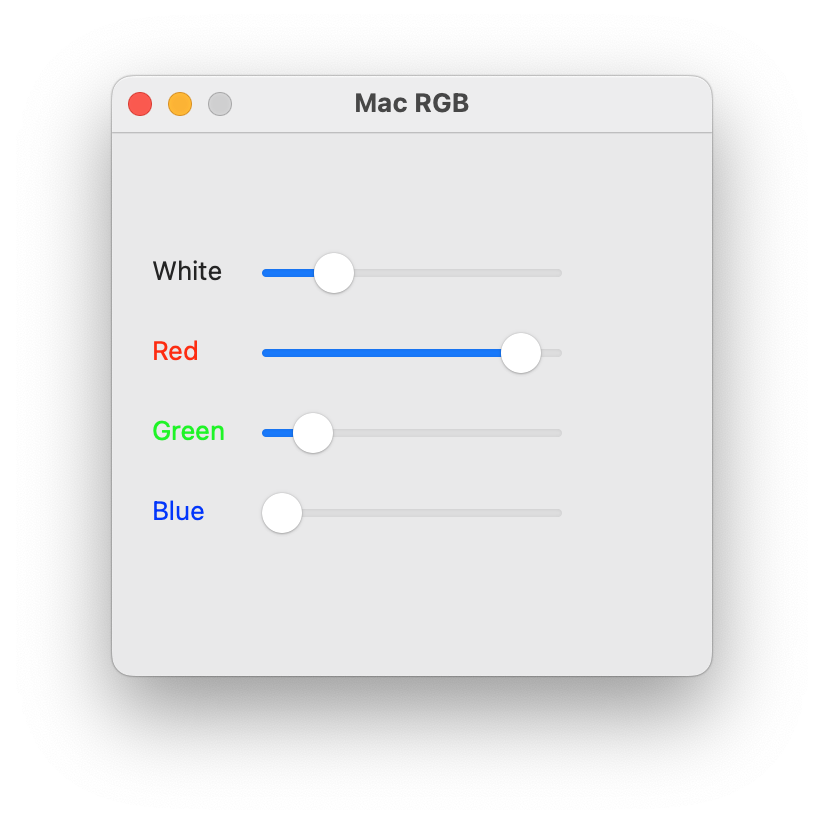

# Mac-RGB
Mac-RGB

RGB LED Control Program.
The program is still under development!

The backlight is controlled through the USB serial port, based on Arduino.

The program supports controlling 4 LEDs at once, red, green, blue, and white, you can make smaller colors, for example, without white.

Arduino schematic here -> [Scheme](https://github.com/DiCode77/Mac-RGB/blob/main/img/2.jpg)

Arduino firmware sketch here -> [Sketch](https://github.com/DiCode77/Mac-RGB/tree/main/sketch)

Program for firmware arduino here -> [Arduino IDE](https://www.arduino.cc/en/software)

For the operation of the entire circuit, and the LED strip, you need a 12V power supply, from one ampere, per ONE meter!

In my case, SMD 5630 LEDs are used, 4 meters, that is, the consumption of one meter of tape is 13.6W/meter, 13.6 * 4 = 54.4W, therefore 54.4 / 12V = 4.5A, which means you need a 12v power supply 5A. 500mA reserve.
You can use a weaker LED strip, then the power supply will fit weaker.

You can read about the maximum workload here -> [IRF740](https://www.vishay.com/docs/91054/91054.pdf)

I want to note that with a heavy load, you need to put a radiator to remove heat, but as a rule you won’t load the transistors even by 50%, in my case, even at 100% brightness they are cold.

As you assemble the circuit, be careful with the 12V power supply so that there is no short circuit, and the voltage does not go to the arduino, and does not damage the USB PORT! Better double check! The scheme is absolutely safe, the main thing is to do everything right.

As we have already assembled the circuit, you need to connect the arduino to the Mac, run the program, the program automatically finds the arduino, and you're done, set your color!
